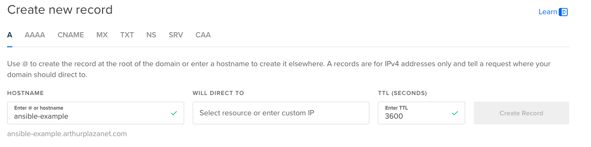
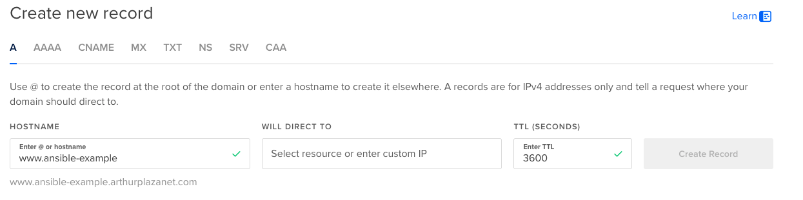

# Setup Nginx Server Block

This project is meant to automate the registration of a new domain on a server, with the default configuration on Nginx and Let's Encrypt SSL certificate.

> [!NOTE]
> If running Certbot for the first time, you will need to enter an email address and accept the terms of service.
> See https://www.digitalocean.com/community/tutorials/how-to-secure-nginx-with-let-s-encrypt-on-ubuntu-20-04

## Requirements

- You need to have a domain pointing to your server. For example on Digital Ocean, you register a domain and create an A record pointing to your server IP.
  
- You need to create the `www` version of your domain pointing to the same server IP.
  

## Example command

```bash
ansible-playbook -i inventories/hosts.yml -K projects/nginx_server_block/nginx_setup_server_block.yml
```

It will ask you the domain name, which can be given without the `www` (it will be added automatically).

```bash
BECOME password:
Which hosts would you like to use?: test
What is the domain name?: test-ansible.de
```

It then prompts for `server_block_mode` (default `static`, just hit enter for the original
static-file behaviour) and `proxy_port`. Answering `proxy` instead reverse-proxies the domain
to `http://127.0.0.1:<proxy_port>` rather than serving `/var/www/<domain>` — for an app that
listens on its own port and should never be bound to `0.0.0.0` directly (e.g. `pm2-dashboard`).
